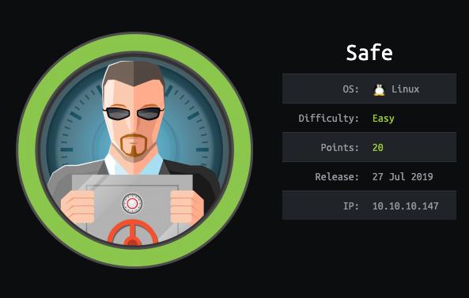

# Safe

I wasn't expecting to find a buffer overflow and ROP chain on a 20 point easy box, but here we are. However, that foothold proved to be the hardest part and honestly was a lot of fun. So let's get started.

# TL;DR

* enumerate the box to find a service (with a custom binary) on port 1337
* Identify the buffer overlfow and create a ROP chain to gain a foothold
* from shell, locate a KeePass vault with images
* crack the KeePass vault using one of the images files to gain root

